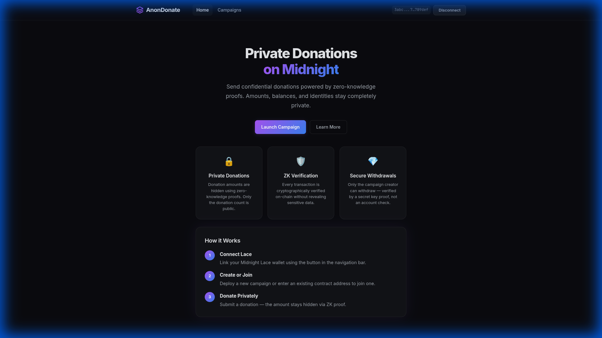
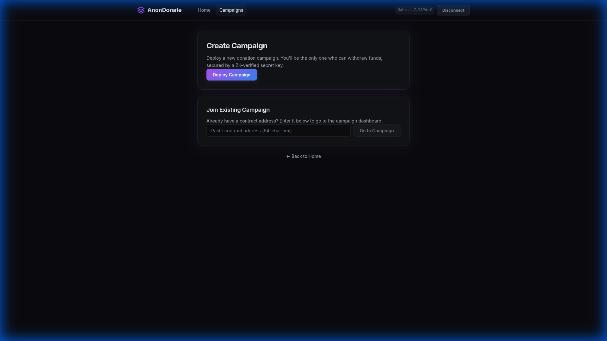
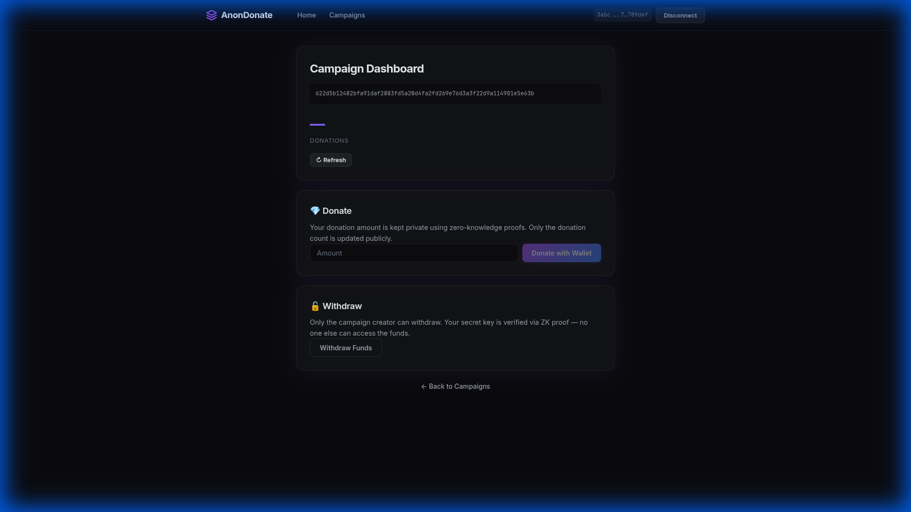

# AnonymousDonation

[](https://shields.io/)

A Midnight DApp for **private donations**: donors give with confidential amounts; only the campaign recipient can withdraw. Donation amounts and wallet balances stay private on-chain.

## 🌐 Deployed Contract Address
`622d5b12482bfa91daf2883fd5a28d4fa2fd269e76d3a3f22d9a114901e5e63b`

## 📸 App Preview

### 🏠 Home Page


### ➕ Create Campaign


### 📊 Campaign Dashboard


## Project structure

```
├── contract/                    # Smart contract (Compact)
│   ├── src/donation.compact     # Donation contract (donate, withdraw)
│   └── src/managed/donation/    # Generated (run "bun run compact")
├── donation-cli/                 # CLI and REST API for AnonymousDonation
│   ├── src/cli.ts               # Interactive CLI (deploy, join, donate, withdraw)
│   ├── src/server.ts            # Express API for the frontend
│   └── proof-server.yml         # Proof server Docker (Preprod/Preview)
└── frontend/                    # React + Vite web UI
    └── src/                     # Pages: wallet, create campaign, campaign, donate
```

## Prerequisites

- **Bun** v1.x (package manager)
- **Docker** (for proof server / standalone stack)
- **Compact compiler** v0.28.0 (see below)

### Compact compiler

```bash
curl --proto '=https' --tlsv1.2 -LsSf https://github.com/midnightntwrk/compact/releases/download/compact-v0.4.0/compact-installer.sh | sh
source $HOME/.local/bin/env
compact update 0.28.0
compact --version   # expect compact 0.4.0
```

## Quick start

### 1. Install and build

```bash
bun install
cd contract && bun run compact && bun run build && bun run test && cd ..
```

(First `compact` run may download ZK parameters and generate ZK keys under `contract/src/managed/donation/keys/`.)

**Before first deploy:** run preflight tests so deploy does not fail with witness or ZK config errors:

```bash
cd donation-cli && bun run preflight
```

If tests report missing verifier keys, run `cd contract && bun run compact` (without `--skip-zk`) and ensure `contract/src/managed/donation/keys/` contains `donation#donate.verifier` and `donation#withdraw.verifier`. If the compiler produced `donate.verifier` / `withdraw.verifier` instead, copy or symlink them with the `donation#` prefix.

### 2. Run the CLI (Preprod)

Start the proof server and CLI:

```bash
cd donation-cli
bun run preprod-ps
```

Then: create or restore a wallet, fund with tNight from the [Preprod faucet](https://faucet.preprod.midnight.network), wait for DUST, then:

- **Deploy campaign** (as recipient) — get a contract address to share.
- **Join campaign** (as donor) — enter the campaign's contract address.
- **Donate** — enter a private amount (only the count is public).
- **Withdraw** — recipient only.

### 3. Run the web app (standalone, local only)

The API server uses **standalone** config (local node, indexer, proof server). Start the full local stack first, then the API and frontend.

**Terminal 1 — local stack (node + indexer + proof server):**

```bash
cd donation-cli
docker compose -f standalone.yml up
```

Wait until node and indexer show healthy (proof server has no healthcheck; it runs once up).

**Terminal 2 — API server:**

```bash
cd donation-cli
bun run server
```

API runs at `http://localhost:3001`.

**Terminal 3 — frontend:**

```bash
cd frontend
bun install
bun run dev
```

Open http://localhost:5173. **Standalone has no faucet** — use &quot;Restore from seed&quot; with genesis seed `0000000000000000000000000000000000000000000000000000000000000001` for a pre-funded wallet. Then create a campaign, or open one by contract address, and donate or withdraw.

Optional: set `VITE_API_URL=http://localhost:3001` in `frontend/.env` if the API is on another host.

## Contract address

When you deploy a campaign, the server returns a **contract address** (hex format). This is the on-chain identity of your campaign:

- **Recipients**: Share this address with donors so they can join and donate
- **Donors**: Enter a campaign's contract address to join, then donate

Where to find it:
- **CLI**: After deploy, printed as `Campaign deployed at: <address>`
- **Web app**: Shown on the Create Campaign page after deployment (with "Copy address" button)
- **Campaign URL**: `/campaign/<contract-address>`

## API (REST server)

| Method | Path | Description |
|--------|------|-------------|
| POST | /wallet | Create or restore wallet (body: `{ seed?: string }`) |
| GET | /wallet | Wallet status, unshielded address, DUST |
| POST | /campaign/deploy | Deploy a campaign (recipient = current wallet); returns `contractAddress` |
| POST | /campaign/join | Join campaign (body: `{ contractAddress }`) |
| POST | /campaign/donate | Donate (body: `{ amount, contractAddress? }`) |
| POST | /campaign/withdraw | Withdraw (recipient only) |
| GET | /campaign/:address | Public state by contract address (donation count) |

## Networks

| Network | Command (CLI) |
|---------|----------------|
| **Preprod** | `bun run preprod-ps` (in donation-cli) |
| **Preview** | `bun run preview-ps` |
| **Standalone** (local) | `bun run standalone` |

## Troubleshooting

| Issue | Solution |
|-------|----------|
| Server stuck on &quot;Syncing with network&quot; / `Failed to connect ws://127.0.0.1:9944` | You're on standalone config; start the local stack first: **Terminal 1** run `cd donation-cli && docker compose -f standalone.yml up`, wait for healthy, then start the API server. |
| `compact: command not found` | `source $HOME/.local/bin/env` |
| `connect ECONNREFUSED 127.0.0.1:6300` | Start proof server: for standalone use `docker compose -f standalone.yml up`; for Preprod use `docker compose -f proof-server.yml up`. |
| Port 6300 not bound after 60s (preprod-ps) | Proof server may be slow; wait is now 120s. Or run proof server manually in one terminal (`docker compose -f proof-server.yml up`), then `bun run preprod` (no `-ps`) in another. |
| No DUST / deploy fails | Fund with tNight from faucet, wait for DUST generation (see CLI output). |
| Wallet stuck on &quot;Waiting for incoming tokens&quot; (standalone) | Use &quot;Restore from seed&quot; with genesis seed `0000...0001` (64 hex chars); standalone has no faucet. |
| Frontend cannot reach API | Ensure API runs on port 3001; set `VITE_API_URL` if different. |

## Links

- [Preprod Faucet](https://faucet.preprod.midnight.network)
- [Midnight Docs](https://docs.midnight.network/)
- [Compact language](https://docs.midnight.network/develop/reference/compact)
- [MIGRATION_GUIDE.md](MIGRATION_GUIDE.md) — Preprod and SDK notes
